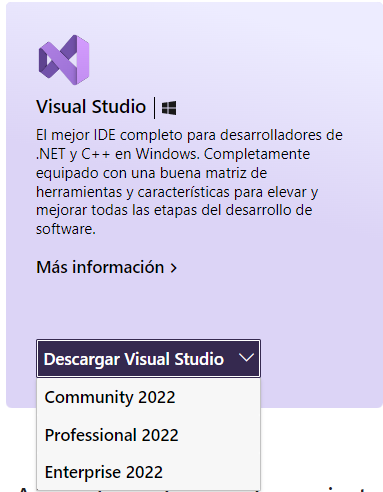
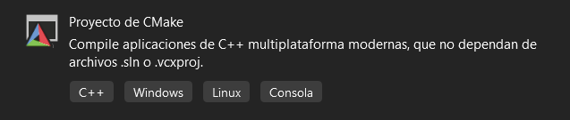

***
# Visual Studio

1. Ir a la siguiente link de [Visual Studio](https://visualstudio.microsoft.com/es/) y escoger una de las opciones (comúnmente es usado la `Professional 2022`)

<div align="center"></div><br>

2. Abrir el ejecutable `VisualStudioSetup.exe` ya descargado hasta que aparezca la ventana de `Visual Studio Installer`.

3. Dirigir a la pestaña `Componentes individuales` donde se encuentra las listas de paquetes en diferentes lenguajes de programación y escoge las específicas para el C++ necesarios:

    - Caracterisiticas principales de C++
    - Herramientas de Cmake en C++ para Windows **(Requisito de Cmake instalado o descargarlo [aqui](https://cmake.org/download/))**
    - MSVC v141 -VS 2017 C++ Build Tools para x64/x86 (o la version mas actual)
    - Herramientas de compilación de C++ de MSVC v143-VS 2022 para x64/x86 (o version mas actual)
    - Módulos de C++ para las herramientas de compilación de v143
    - Windows 10 SDK (o Windows 11 SDK para el sistema `Windows 11`)
    - IntelliCode

    Ya seleccionados, dar a instalar. Esto puede tardar varios minutos.

***
# SFML con Vcpkg

1. Instalar Vcpkg en la terminal con

    ```bash
    git clone https://github.com/Microsoft/vcpkg.git
    ```

    ```bash
    .\vcpkg\bootstrap-vcpkg.bat
    ```

2. Instalar SFML y ligar con Visual Studio con:

    ```bash
    vcpkg install sfml:x64-windows
    ```

    ```bash
    vcpkg integrate install 
    ```

3. Para probar el funcionamiento de esta librería, abre `Visual Studio 2022`, dirigir al botón `Crear un proyecto` y escoger la opción de:

<div align="center"></div><br>


4. Asegurar que tengas abierto el apartado `Explorador de soluciones` en el entorno y edición.

5. Ir al archivo `CMakeLists.txt`, y reescribir todo el código con:

    ```cmake
    cmake_minimum_required(VERSION 3.23)  # opcional cambiar de version 
    project(name_file)

    set(CMAKE_CXX_STANDARD 20)
    add_executable(name_file main.cpp)

    set(SFML_STATIC_LIBRARIES TRUE)
    set(SFML_DIR C:/src/vcpkg/installed/x64-windows/share/sfml)
    find_package(SFML COMPONENTS system window graphics audio CONFIG REQUIRED) # opcional editar los componentes necesarios 
    include_directories(C:/src/vcpkg/packages/sfml_x64-windows/include)

    target_link_libraries(name_file PRIVATE sfml-system sfml-network sfml-graphics sfml-window)
    ```

    Donde `name_file` es el nombre del proyecto abierto.

***
Para probar SMFL puedes copiar este coigo y pegar en tu archivo:

```cpp
#include <SFML/Graphics.hpp>

int main(int argc, char* argv[]) {
    sf::RenderWindow window(sf::VideoMode(200, 200), "SFML works!");
    sf::CircleShape shape(100.F);
    shape.setFillColor(sf::Color::Green);

    while (window.isOpen()) {
        sf::Event event;
        while (window.pollEvent(event)) {
            if (event.type == sf::Event::Closed)
                window.close();
        }

        window.clear();
        window.draw(shape);
        window.display();
    }
    return 0;
}

```